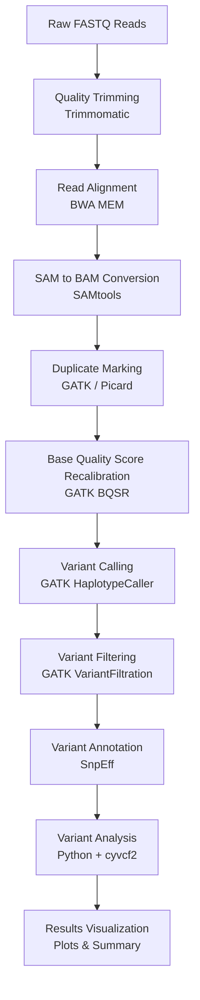
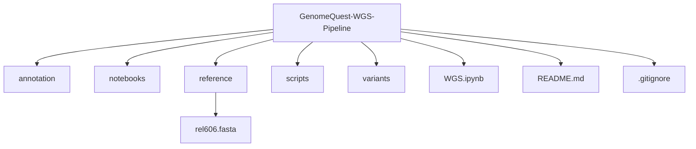

### GenomeQuest: Whole Genome Sequencing Variant Analysis Pipeline

A complete bioinformatics pipeline for identifying genomic mutations in E. coli using Illumina Whole Genome Sequencing (WGS) data.
This project implements a full variant discovery workflow, including read preprocessing, alignment, variant calling, filtering, annotation, and downstream analysis.
The pipeline was developed to identify mutations acquired during experimental evolution by comparing an evolved strain to its ancestral genome.

### Biological Background
This project analyzes data from Richard Lenski’s Long-Term Evolution Experiment (LTEE).
Started in 1988, LTEE tracks the evolution of E. coli populations for tens of thousands of generations under controlled laboratory conditions.

### Key discoveries from LTEE include:
Continuous increases in bacterial fitness
Parallel evolution across independent populations
Emergence of novel metabolic traits (e.g., citrate utilization)
The dataset analyzed here corresponds to an evolved isolate:
SRR2584866

The reference genome used is the ancestral strain:
Escherichia coli REL606
Accession: CP000819.1
Genome size: 4.63 Mb
By comparing the evolved strain with the ancestral genome, we can identify mutations accumulated during evolution.

### Pipeline Overview
This pipeline performs the following major steps:
1. Quality trimming of sequencing reads
2. Alignment to the reference genome
3. BAM processing and duplicate marking
4. Base quality score recalibration (BQSR)
5. Variant calling using GATK HaplotypeCaller
6. Variant filtering
7. Variant annotation
8. Variant analysis and visualization

### Pipeline Workflow

#### Tools Used
Tool	                             Purpose
Trimmomatic	                Read quality trimming
BWA-MEM	                       Read alignment
SAMtools	                     BAM processing
Picard	                     Duplicate marking
GATK	                       Variant discovery
SnpEff	                     Variant annotation
Python	                      Variant analysis
cyvcf2	                         VCF parsing

#### Dataset
Sequencing data is obtained from NCBI SRA.
Dataset: SRR2584866
Download the data using:
prefetch SRR2584866
fasterq-dump SRR2584866
This will generate paired-end FASTQ files.
Reference Genome
Reference genome used:
Escherichia coli REL606
NCBI Accession: CP000819.1
Genome length: 4,629,812 bp

#### Key Pipeline Steps

#### 1. Quality Trimming
Low-quality bases and adapter sequences are removed using Trimmomatic.
Output:
trimmed_reads/

#### 2. Alignment
Reads are aligned to the reference genome using BWA-MEM.
Output: alignment/aligned_rel606.sam

#### 3. BAM Processing
The SAM file is converted to BAM, sorted, and indexed.
Tools used:
samtools
Picard / GATK

#### 4. Duplicate Marking
PCR duplicates are identified and flagged to avoid bias during variant calling.

#### 5. Base Quality Score Recalibration
GATK BQSR corrects systematic errors in sequencing quality scores.

#### 6. Variant Calling
Variants are detected using:
GATK HaplotypeCaller
Since bacteria are haploid, the pipeline uses:
--sample-ploidy 1

#### 7. Variant Filtering
Variants are filtered based on multiple quality metrics:
QD
MQ
FS
DP
QUAL
ReadPosRankSum

#### 8. Variant Annotation
Variants are annotated using SnpEff, which provides:
Gene names
Mutation type
Functional impact
Amino acid changes

### Results
Variant Type	        Count
PASS SNPs	            661
PASS Indels	          110
Missense Variants	    375
Synonymous Variants	  214
High Impact Variants	 11

Mean sequencing coverage: 144x
Genome size: 4.63 Mb
Fraction of genome affected: 0.017%

### Repository Structure

Large sequencing files are excluded from the repository to keep the project lightweight.

### To run the pipeline:
conda activate wgs_pipeline
Then execute each step of the workflow in sequence.

### Acknowledgment
Dataset derived from:
Lenski, R. E. Long-Term Evolution Experiment (LTEE)
